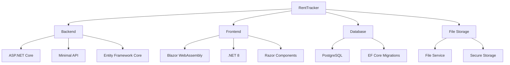
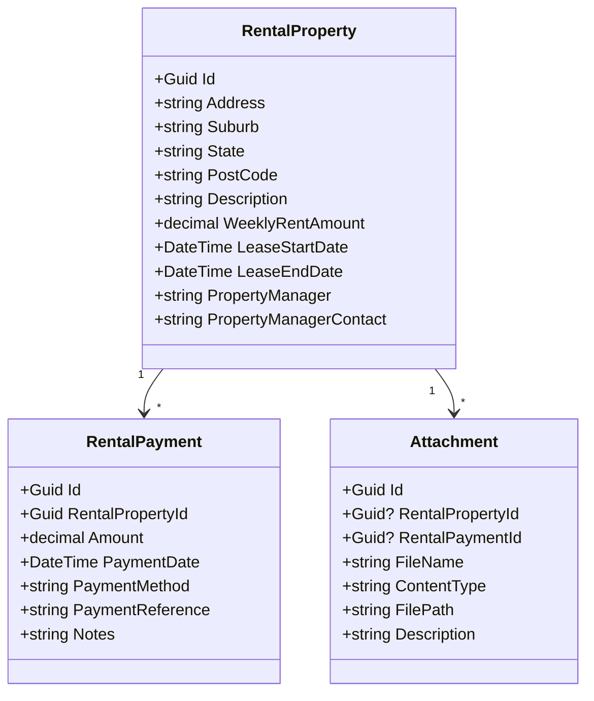
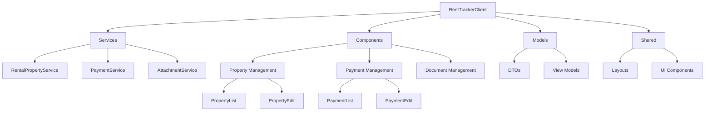
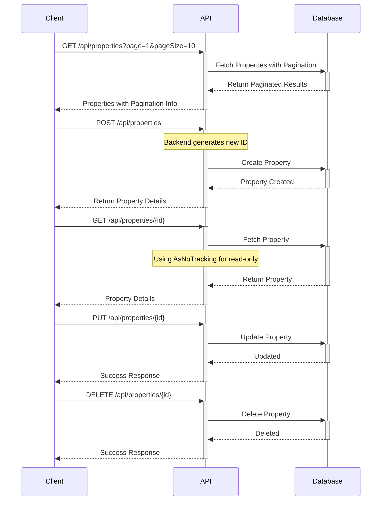
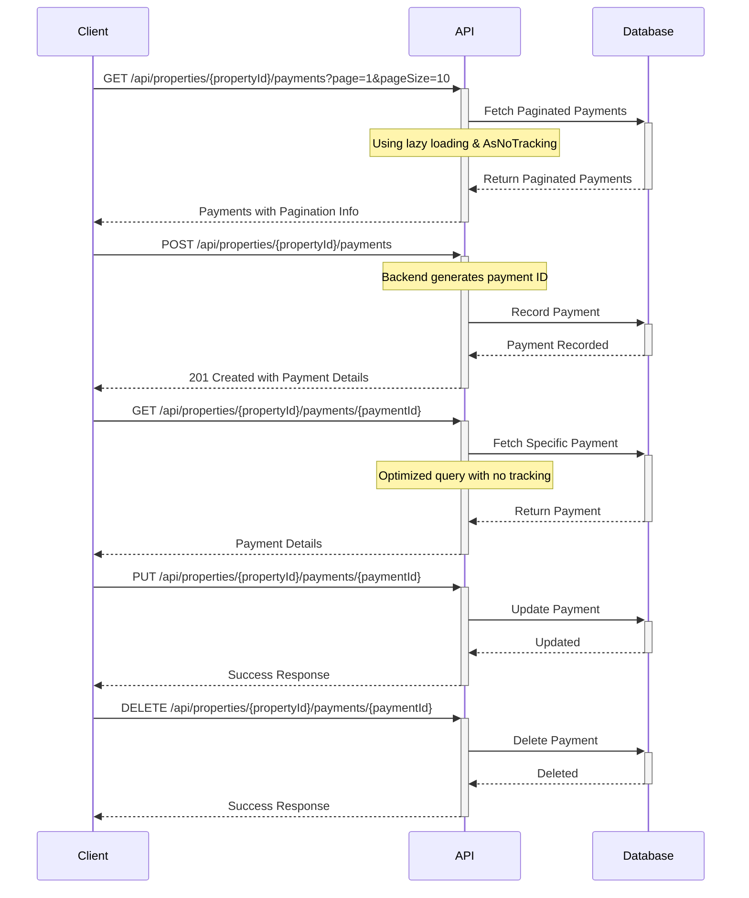
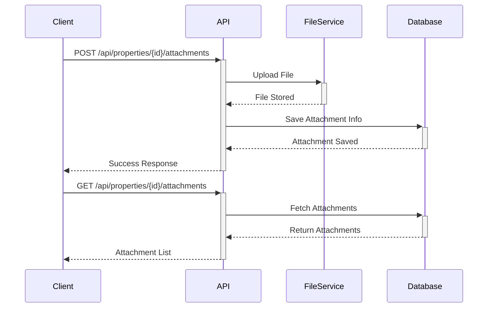

# RentTracker

[](https://github.com/yourusername/RentTracker)
[](https://opensource.org/licenses/Apache-2.0)
[](https://github.com/yourusername/RentTracker/actions)

A comprehensive rental property management system for tracking payments and managing property-related documents.

## Overview

RentTracker is a modern property management solution built with ASP.NET Core and Blazor WebAssembly that helps landlords efficiently manage their rental properties, track payments, and handle property-related documents. The system provides an intuitive web application with a robust backend API for property management operations while maintaining secure data storage and file handling capabilities.

## Getting Started

### Quick Start

```bash
# Clone the repository
git clone https://github.com/yourusername/RentTracker.git
cd RentTracker

# Set up database connection in appsettings.json
# Run database migrations
cd RentTrackerBackend
dotnet ef database update

# Run the backend
dotnet run

# In another terminal, run the frontend
cd ../RentTrackerClient
dotnet run
```

## Features

### Existing Features
* Property Management
  - Add, edit, and delete rental properties with server-side ID generation
  - Store property details (address, rent amount, lease dates)
  - Manage property manager information
  - Paginated property list with search functionality
* Payment Tracking
  - Record and manage rental payments through nested endpoints
  - Track payment history with property context
  - Monitor payment status with optimized performance
  - Paginated payment list with search functionality
* Document Management
  - Upload and store property-related documents
  - Secure file storage and retrieval
  - Support for various document types
* Enhanced Property Management
  - Comprehensive property information storage
  - Lease agreement tracking
  - Property manager contact details
  - Improved navigation between properties and payments
* Modern Web Interface
  - Responsive Blazor WebAssembly client with optimized UI
  - Full-screen layout with efficient navigation
  - Real-time data updates with pagination support
  - Dedicated components for property listing and editing

### RentTrackerClient Features
* Modern Component Architecture
  - Separate PropertyList and PropertyEdit components
  - Dedicated Payments component with property context
  - Reusable UI components for consistency
* Enhanced User Experience
  - Paginated lists for both properties and payments
  - Intuitive navigation between properties and their payments
  - Full-screen layouts for better space utilization
  - Consistent styling across components
* Service Layer
  - Typed HTTP client services
  - Support for paginated API responses
  - Proper error handling and validation
  - Efficient state management
* Performance Optimizations
  - Lazy loading of related data
  - Efficient data fetching with pagination
  - Optimized API calls with proper caching
  - Minimal client-side processing

### Planned Features
* Multi-tenancy Support with Authentication
* Docker Containerization
* Enhanced Reporting
  - Financial analysis tools
  - Custom report generation
  - Data visualization
* Dashboard with Key Metrics
* Payment Reminder System
* Improved Data Export
* Advanced Search and Filtering
* Enhanced API Documentation

## Project Status and Roadmap

### Current Status
- [x] Enhanced Property Management with Pagination
- [x] Optimized Payment Tracking with Nested Endpoints
- [x] Document Storage System
- [x] Improved Client Architecture
- [x] Performance Optimizations
- [ ] Multi-tenancy Support
- [ ] Advanced Reporting
- [ ] Payment Reminder System

### Recent Achievements
- ✅ Implemented optimized payment endpoints
- ✅ Added pagination support for properties and payments
- ✅ Enhanced client-side architecture with modular components
- ✅ Improved query performance with lazy loading
- ✅ Updated navigation and UI components

### Upcoming Milestones
1. Q2 2025: Implement Multi-tenancy
2. Q3 2025: Enhanced Reporting Features
3. Q4 2025: Docker Containerization and CI/CD Pipeline

## Architecture

### Technology Stack



* **Backend Framework**: ASP.NET Core minimal API (.NET 8)
* **Frontend Framework**: Blazor WebAssembly (.NET 8)
* **ORM**: Entity Framework Core with optimized query patterns
* **Database**: PostgreSQL
* **Architecture Pattern**: RESTful API with nested endpoints
* **File Management**: Custom FileService implementation
* **UI Components**: Modular Razor Components
* **Client Architecture**: Service-based with typed HTTP clients

### Backend Implementation

#### Core Models



### Client Architecture



#### Service Layer
- Typed HTTP clients for API communication
- Pagination support with generic response types
- Error handling and validation
- State management for UI components

#### Component Structure
- Modular design with separate components per feature
- Shared UI components for consistency
- Full-screen layouts with efficient navigation
- Property-specific payment context maintenance

#### State Management
- Local component state for UI interactions
- Service-level caching for API responses
- Pagination state management
- Loading and error states

## API Documentation

### Property Management

#### Endpoints



| Method | Endpoint | Description |
|--------|----------|-------------|
| GET | `/api/properties` | List all properties |
| GET | `/api/properties/{id}` | Get property details |
| POST | `/api/properties` | Create new property |
| PUT | `/api/properties/{id}` | Update property |
| DELETE | `/api/properties/{id}` | Delete property |

### Payment Management



| Method | Endpoint | Description |
|--------|----------|-------------|
| GET | `/api/properties/{propertyId}/payments?page={page}&pageSize={size}` | List paginated payments for a property |
| GET | `/api/properties/{propertyId}/payments/{paymentId}` | Get specific payment details (optimized query) |
| POST | `/api/properties/{propertyId}/payments` | Record new payment with backend-generated ID |
| PUT | `/api/properties/{propertyId}/payments/{paymentId}` | Update payment details |
| DELETE | `/api/properties/{propertyId}/payments/{paymentId}` | Delete payment record |

### Document Management



| Method | Endpoint | Description |
|--------|----------|-------------|
| GET | `/api/properties/{id}/attachments` | List property attachments |
| POST | `/api/properties/{id}/attachments` | Upload attachment |
| GET | `/api/attachments/{id}` | Download attachment |
| DELETE | `/api/attachments/{id}` | Delete attachment |

## Setup Guide

### Prerequisites
- .NET 8 SDK (latest version)
- PostgreSQL database server (13.0 or higher)
- Storage location for file uploads (with proper permissions)
- Visual Studio Code (recommended) or Visual Studio 2022

### Development Environment Setup
- Install Visual Studio Code and the C# Dev Kit extension
- Configure the following extensions:
  * C# Dev Kit for .NET development
  * .NET Core Test Explorer for running tests
  * GitLens for enhanced Git integration
  * REST Client for testing API endpoints
- Set up PostgreSQL and create a new database
- Configure file storage permissions

### Installation Steps

1. Clone the repository:
```bash
git clone https://github.com/yourusername/RentTracker.git
cd RentTracker
```

2. Update database connection in `RentTrackerBackend/appsettings.json`:
```json
{
  "ConnectionStrings": {
    "DefaultConnection": "Host=localhost;Database=renttracker;Username=your_username;Password=your_password"
  }
}
```

3. Run database migrations:
```bash
cd RentTrackerBackend
dotnet ef database update
```

4. Run the backend:
```bash
dotnet run
```

5. Run the frontend:
```bash
cd ../RentTrackerClient
dotnet run
```

The backend API will be available at `https://localhost:5001`, and the frontend at `https://localhost:5002`.

### Development Notes
- Enable hot reload for faster development iterations
- Use the integrated terminal for running commands
- Utilize the built-in debugger for both backend and frontend
- Configure user secrets for sensitive configuration
- Follow the code style and organization patterns

### Performance Considerations
- Backend Optimizations:
  * Lazy loading patterns for related data
  * AsNoTracking for read-only operations
  * Efficient query patterns with proper includes
  * Pagination for all list operations
  * Proper indexing on database tables

- Frontend Optimizations:
  * Component-level state management
  * Efficient API call patterns
  * Proper caching strategies
  * Optimized rendering with proper component lifecycle
  * Minimized re-renders using proper state management

## Contributing

1. Fork the repository
2. Create a feature branch
3. Commit your changes
4. Push to the branch
5. Create a Pull Request

## Support and Contact

If you encounter any issues or have questions, please [open an issue](https://github.com/yourusername/RentTracker/issues) on GitHub.

For commercial support or custom development, contact: support@renttracker.com

## License

Apache 2.0 © 2024
