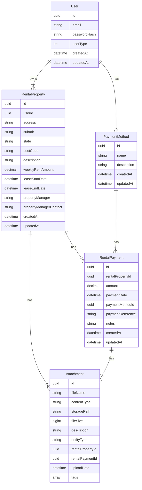
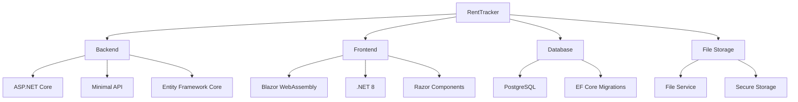
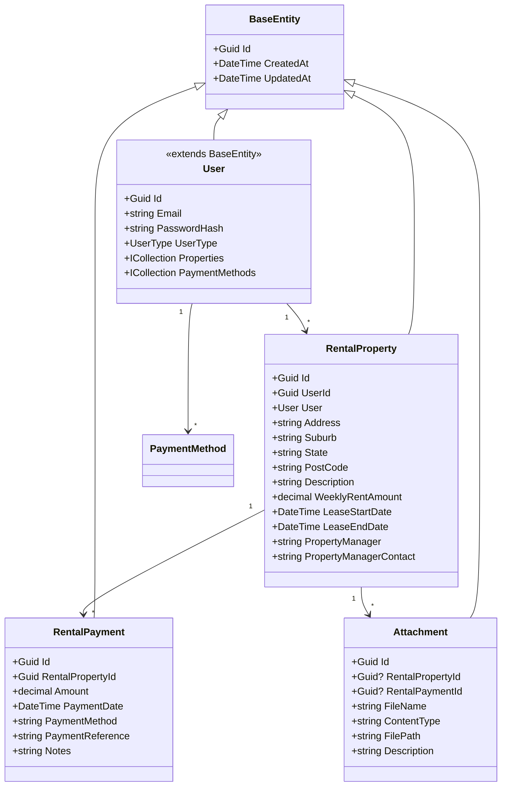
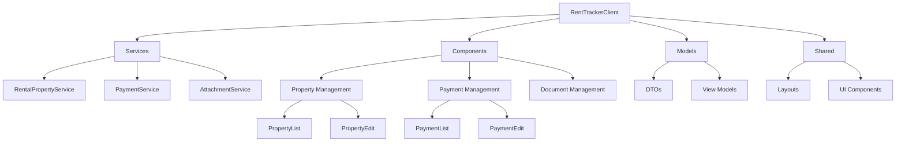
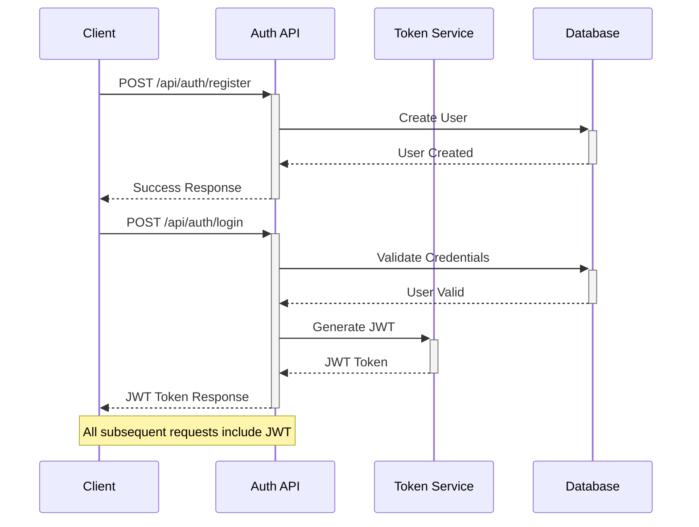
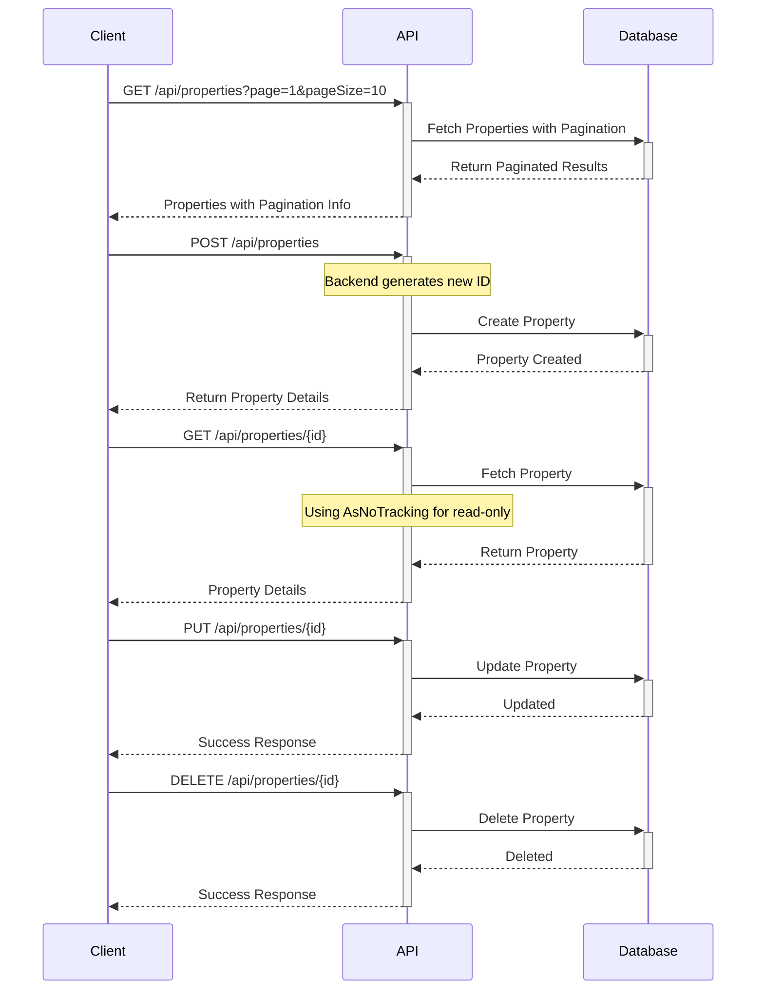
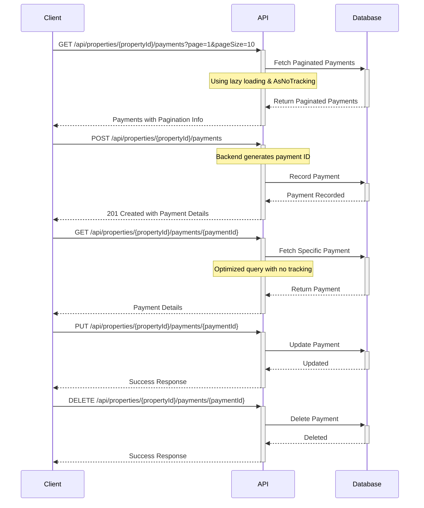
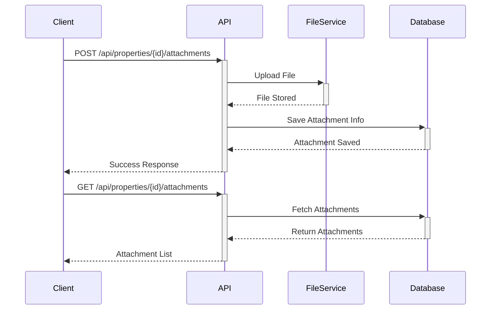

# RentTracker

[](https://github.com/yourusername/RentTracker)
[](https://opensource.org/licenses/Apache-2.0)
[](https://github.com/yourusername/RentTracker/actions)

A comprehensive multi-tenant rental property management system for tracking payments and managing property-related documents.

## Overview

RentTracker is a modern property management solution built with ASP.NET Core and Blazor WebAssembly that helps landlords efficiently manage their rental properties, track payments, and handle property-related documents. The system provides an intuitive web application with a robust backend API for property management operations while maintaining secure data storage, multi-tenancy support, and file handling capabilities.

## Getting Started

### Quick Start

```bash
# Clone the repository
git clone https://github.com/yourusername/RentTracker.git
cd RentTracker

# Set up database connection in appsettings.json
# Run database migrations
cd RentTrackerBackend
dotnet ef database update

# Run the backend
dotnet run

# In another terminal, run the frontend
cd ../RentTrackerClient
dotnet run
```

## Features

### Existing Features
* Multi-tenancy Support
  - Role-based access control with Admin and Normal user types
  - JWT-based authentication
  - Data isolation between users
  - User-specific property and payment management
* Property Management
  - Add, edit, and delete rental properties with server-side ID generation
  - Store property details (address, rent amount, lease dates)
  - Manage property manager information
  - Paginated property list with search functionality
* Payment Tracking
  - Record and manage rental payments through nested endpoints
  - Track payment history with property context
  - Monitor payment status with optimized performance
  - Paginated payment list with search functionality
* Document Management
  - Upload and store property-related documents
  - Secure file storage and retrieval
  - Support for various document types
  - Document tagging and categorization
* Enhanced Property Management
  - Comprehensive property information storage
  - Lease agreement tracking
  - Property manager contact details
  - Improved navigation between properties and payments

### RentTrackerClient Features
* Modern Component Architecture
  - Separate PropertyList and PropertyEdit components
  - Dedicated Payments component with property context
  - Reusable UI components for consistency
* Enhanced User Experience
  - Paginated lists for both properties and payments
  - Intuitive navigation between properties and their payments
  - Full-screen layouts for better space utilization
  - Consistent styling across components
* Service Layer
  - Typed HTTP client services
  - Support for paginated API responses
  - Proper error handling and validation
  - Efficient state management
* Performance Optimizations
  - Lazy loading of related data
  - Efficient data fetching with pagination
  - Optimized API calls with proper caching
  - Minimal client-side processing

### Planned Features
* Docker Containerization with CI/CD Pipeline
* Enhanced Reporting
  - Financial analysis tools
  - Custom report generation
  - Data visualization
* Dashboard with Key Metrics
* Payment Reminder System
* Improved Data Export
* Advanced Search and Filtering
* Enhanced API Documentation

## Project Status and Roadmap

### Current Status
- [x] Enhanced Property Management with Pagination
- [x] Optimized Payment Tracking with Nested Endpoints
- [x] Document Storage System
- [x] Improved Client Architecture
- [x] Performance Optimizations
- [x] Multi-tenancy Support Implementation
- [ ] Docker Containerization
- [ ] Advanced Reporting
- [ ] Payment Reminder System

### Recent Achievements
- ✅ Implemented multi-tenancy with JWT authentication
- ✅ Added role-based access control
- ✅ Enhanced data isolation between users
- ✅ Improved query performance with user context
- ✅ Updated client architecture for multi-tenant support

### Upcoming Milestones
1. Q2 2025: Docker Containerization and CI/CD Pipeline
2. Q3 2025: Enhanced Reporting Features
3. Q4 2025: Advanced Analytics and Payment Reminders

## Architecture

[Additional architecture details available in docs/multi-tenancy-plan.md]

## Database Schema

The database schema represents a multi-tenant rental property management system with 5 main entities. The system supports multiple users, where each user manages their own properties and payment methods, while having access to system-wide default payment methods:

1. **User**:
   - Core entity for authentication and authorization
   - Supports multiple user types (Admin/Normal)
   - Controls access to properties and payments

2. **RentalProperty**:
   - Core entity storing property details
   - Linked to specific users for multi-tenancy
   - Has one-to-many relationships with RentalPayment and Attachment

2. **RentalPayment**:
   - Tracks payments made for properties
   - Connected to RentalProperty and PaymentMethod (many-to-one)
   - Can have multiple attachments (one-to-many with Attachment)

3. **PaymentMethod**:
    - Stores different payment methods
    - Has a one-to-many relationship with RentalPayment
    - Can be user-specific (UserId) or system-wide (IsSystemDefault)

4. **Attachment**:
   - Handles file storage for both properties and payments
   - Contains metadata like fileName, contentType, fileSize
   - Links to either RentalProperty or RentalPayment through their IDs

Key Relationships:
- A RentalProperty can have many RentalPayments
- A PaymentMethod can be used for many RentalPayments
- Both RentalProperty and RentalPayment can have multiple Attachments

All entities include standard audit fields (createdAt, updatedAt) and use UUID primary keys for identification. The multi-tenant design ensures:
- Each user has their own set of rental properties
- Properties are automatically deleted when a user is deleted (cascade delete)
- Payment methods can be user-specific or system-wide defaults
- Each user's data is isolated from other users



### Technology Stack


* **Backend Framework**: ASP.NET Core minimal API (.NET 8)
* **Frontend Framework**: Blazor WebAssembly (.NET 8)
* **Authentication**: JWT-based authentication
* **ORM**: Entity Framework Core with optimized query patterns
* **Database**: PostgreSQL
* **Architecture Pattern**: RESTful API with nested endpoints
* **File Management**: Custom FileService implementation
* **UI Components**: Modular Razor Components
* **Client Architecture**: Service-based with typed HTTP clients
* **Client Architecture**: Service-based with typed HTTP clients

### Backend Implementation

#### Core Models



### Client Architecture



#### Service Layer
- Typed HTTP clients for API communication
- Pagination support with generic response types
- Error handling and validation
- State management for UI components

#### Component Structure
- Modular design with separate components per feature
- Shared UI components for consistency
- Full-screen layouts with efficient navigation
- Property-specific payment context maintenance

#### State Management
- Local component state for UI interactions
- Service-level caching for API responses
- Pagination state management
- Loading and error states

## API Documentation

### Authentication and Authorization



#### Authentication Endpoints

| Method | Endpoint | Description | Request Body | Response |
|--------|----------|-------------|--------------|-----------|
| POST | `/api/auth/register` | Register new user | `{ "email": string, "password": string, "confirmPassword": string, "userType": "User"⎮"Admin" }` | Created user details |
| POST | `/api/auth/login` | Login user | `{ "email": string, "password": string }` | JWT token |

#### Multi-Tenancy Implementation

- All endpoints require JWT authentication token in the `Authorization: Bearer <token>` header
- User data is isolated using the `userId` from the JWT token
- Admin users can access system-wide resources
- Normal users can only access their own resources
- Property endpoints filter results by the authenticated user's ID
- System-wide payment methods are accessible to all users, while user-specific methods are isolated

### Property Management

#### Endpoints



| Method | Endpoint | Description | Auth |
|--------|----------|-------------|------|
| GET | `/api/properties` | List user's properties | `Bearer JWT` Required |
| GET | `/api/properties/{id}` | Get property details | `Bearer JWT` Required, Owner Only |
| POST | `/api/properties` | Create new property | `Bearer JWT` Required |
| PUT | `/api/properties/{id}` | Update property | `Bearer JWT` Required, Owner Only |
| DELETE | `/api/properties/{id}` | Delete property | `Bearer JWT` Required, Owner Only |

### Payment Management



| Method | Endpoint | Description | Auth |
|--------|----------|-------------|------|
| GET | `/api/properties/{propertyId}/payments?page={page}&pageSize={size}` | List paginated payments for a property | `Bearer JWT` Required, Property Owner Only |
| GET | `/api/properties/{propertyId}/payments/{paymentId}` | Get specific payment details | `Bearer JWT` Required, Property Owner Only |
| POST | `/api/properties/{propertyId}/payments` | Record new payment | `Bearer JWT` Required, Property Owner Only |
| PUT | `/api/properties/{propertyId}/payments/{paymentId}` | Update payment details | `Bearer JWT` Required, Property Owner Only |
| DELETE | `/api/properties/{propertyId}/payments/{paymentId}` | Delete payment record | `Bearer JWT` Required, Property Owner Only |

### Document Management



| Method | Endpoint | Description | Auth |
|--------|----------|-------------|------|
| GET | `/api/properties/{id}/attachments` | List property attachments | `Bearer JWT` Required, Property Owner Only |
| POST | `/api/properties/{id}/attachments` | Upload attachment | `Bearer JWT` Required, Property Owner Only |
| GET | `/api/attachments/{id}` | Download attachment | `Bearer JWT` Required, Owner Only |
| DELETE | `/api/attachments/{id}` | Delete attachment | `Bearer JWT` Required, Owner Only |

## Setup Guide

### Prerequisites
- .NET 8 SDK (latest version)
- PostgreSQL database server (13.0 or higher)
- Storage location for file uploads (with proper permissions)
- Visual Studio Code (recommended) or Visual Studio 2022
- Git for version control
- Node.js and npm for frontend development tools

### Database Setup and Seeding
The application uses Entity Framework Core for database management and includes automatic migrations and data seeding:

#### Migrations
Migrations are automatically applied when the application starts:
```csharp
// In Program.cs
using (var scope = app.Services.CreateScope())
{
    var dbContext = services.GetRequiredService<ApplicationDbContext>();
    await dbContext.Database.MigrateAsync();
}
```

You can also manually apply migrations using:
```bash
cd RentTrackerBackend
dotnet ef database update
```

#### Sample Data
The application includes a `DatabaseSeeder` that automatically populates the database with sample data when it's empty:

- **Rental Properties**:
  * Sydney CBD apartment (2 bedrooms, $650/week)
  * Bondi beach house (3 bedrooms, $950/week)

- **Rental Payments**:
  * Initial payments including bonds
  * Regular rent payments with references

- **Sample Attachments**:
  * Lease agreements
  * Payment receipts

The seeder only runs if the database is empty, making it safe for production environments.

### Development Environment Setup
- Install Visual Studio Code and the C# Dev Kit extension
- Configure the following extensions:
  * C# Dev Kit for .NET development
  * .NET Core Test Explorer for running tests
  * GitLens for enhanced Git integration
  * REST Client for testing API endpoints
- Set up PostgreSQL and create a new database
- Configure file storage permissions

### Installation Steps

1. Clone the repository:
```bash
git clone https://github.com/yourusername/RentTracker.git
cd RentTracker
```

2. Configure the database connection:

Create or update `RentTrackerBackend/appsettings.json`:
```json
{
  "ConnectionStrings": {
    "DefaultConnection": "Host=localhost;Database=renttracker;Username=your_username;Password=your_password"
  },
  "JwtSettings": {
    "SecretKey": "your-secret-key-here",
    "Issuer": "renttracker",
    "Audience": "renttracker-client",
    "ExpiryInMinutes": 60
  }
}
```

For development, you can use user secrets to store sensitive configuration:
```bash
cd RentTrackerBackend
dotnet user-secrets init
dotnet user-secrets set "ConnectionStrings:DefaultConnection" "Host=localhost;Database=renttracker;Username=your_username;Password=your_password"
dotnet user-secrets set "JwtSettings:SecretKey" "your-secret-key-here"
```

3. Verify database setup:
```bash
# Check database connection and migrations status
cd RentTrackerBackend
dotnet ef migrations list
dotnet ef database update --verbose
```

The application will automatically:
- Apply any pending migrations
- Create required directories for file uploads
- Seed sample data if the database is empty
- Create a default admin user if none exists

3. Run database migrations:
```bash
cd RentTrackerBackend
dotnet ef database update
```

4. Run the backend:
```bash
dotnet run
```

5. Run the frontend:
```bash
cd ../RentTrackerClient
dotnet run
```

The backend API will be available at `https://localhost:5001`, and the frontend at `https://localhost:5002`.

### Development Notes
- Enable hot reload for faster development iterations
- Use the integrated terminal for running commands
- Utilize the built-in debugger for both backend and frontend
- Configure user secrets for sensitive configuration
- Follow the code style and organization patterns
- Review multi-tenancy documentation in docs/multi-tenancy-plan.md

### Performance Considerations
- Backend Optimizations:
  * Lazy loading patterns for related data
  * AsNoTracking for read-only operations
  * Efficient query patterns with proper includes
  * Pagination for all list operations
  * Proper indexing on database tables

- Frontend Optimizations:
  * Component-level state management
  * Efficient API call patterns
  * Proper caching strategies
  * Optimized rendering with proper component lifecycle
  * Minimized re-renders using proper state management

## Contributing

1. Fork the repository
2. Create a feature branch
3. Commit your changes
4. Push to the branch
5. Create a Pull Request

## Support and Contact

For technical questions or issues, please [open an issue](https://github.com/yourusername/RentTracker/issues) on GitHub.

For documentation on multi-tenancy implementation, refer to docs/multi-tenancy-plan.md.

For commercial support or custom development, contact: support@renttracker.com

## License

Apache 2.0 © 2024
