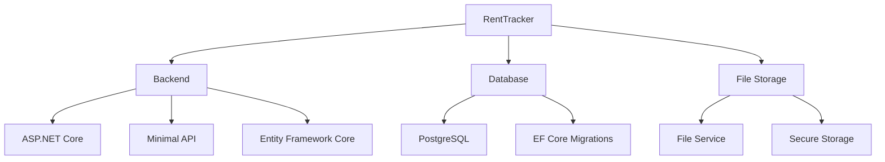
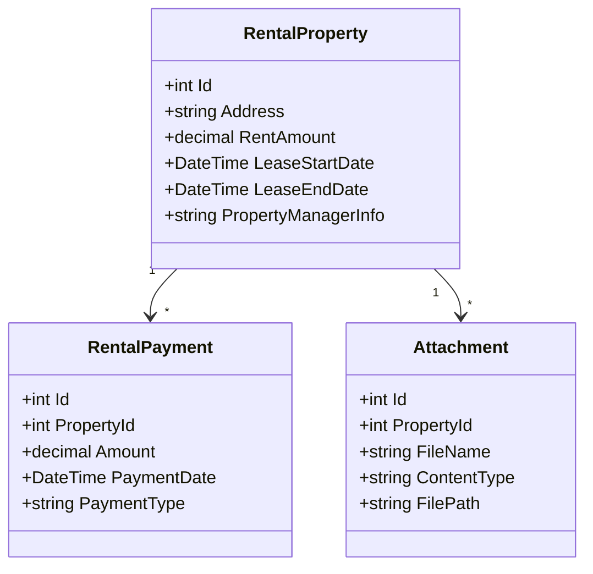
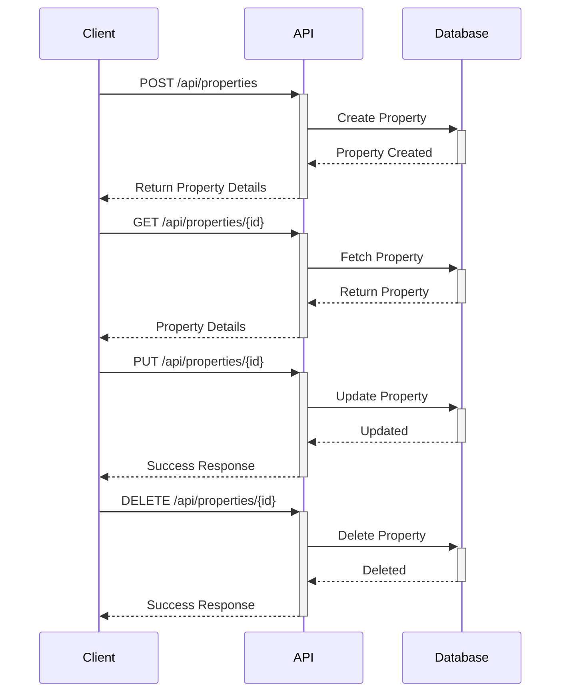
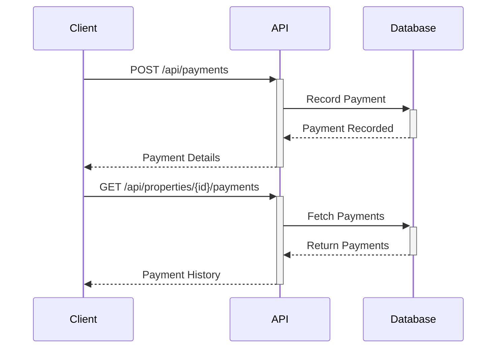
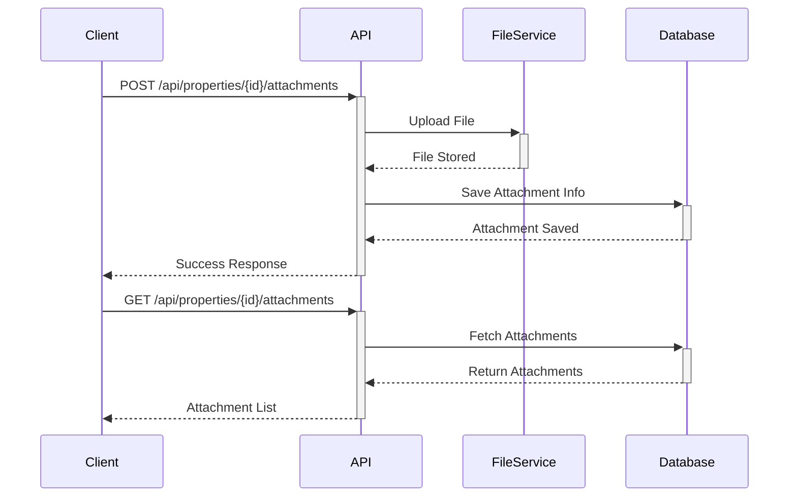

# RentTracker

A comprehensive rental property management system for tracking payments and managing property-related documents.

## Overview

RentTracker is a modern property management solution built with ASP.NET Core that helps landlords efficiently manage their rental properties, track payments, and handle property-related documents. The system provides an intuitive API for property management operations while maintaining robust data storage and file handling capabilities.

## Features

### Existing Features
* Property Management
  - Add, edit, and delete rental properties
  - Store property details (address, rent amount, lease dates)
  - Manage property manager information
* Payment Tracking
  - Record and manage rental payments
  - Track payment history
  - Monitor payment status
* Document Management
  - Upload and store property-related documents
  - Secure file storage and retrieval
  - Support for various document types
* Basic Property Details
  - Comprehensive property information storage
  - Lease agreement tracking
  - Property manager contact details

### Planned Features
* Multi-tenancy Support with Authentication
* Docker Containerization
* Enhanced Reporting
  - Financial analysis tools
  - Custom report generation
  - Data visualization
* Dashboard with Key Metrics
* Payment Reminder System
* Improved Data Export
* Advanced Search and Filtering
* Enhanced API Documentation

## Architecture

### Technology Stack



* **Backend Framework**: ASP.NET Core minimal API (.NET 6+)
* **ORM**: Entity Framework Core
* **Database**: PostgreSQL
* **Architecture Pattern**: RESTful API
* **File Management**: Custom FileService implementation

### Core Models



## API Documentation

### Property Management

#### Endpoints



| Method | Endpoint | Description |
|--------|----------|-------------|
| GET | `/api/properties` | List all properties |
| GET | `/api/properties/{id}` | Get property details |
| POST | `/api/properties` | Create new property |
| PUT | `/api/properties/{id}` | Update property |
| DELETE | `/api/properties/{id}` | Delete property |

### Payment Management



| Method | Endpoint | Description |
|--------|----------|-------------|
| GET | `/api/payments` | List all payments |
| GET | `/api/properties/{id}/payments` | Get property payments |
| POST | `/api/payments` | Record new payment |
| PUT | `/api/payments/{id}` | Update payment |

### Document Management



| Method | Endpoint | Description |
|--------|----------|-------------|
| GET | `/api/properties/{id}/attachments` | List property attachments |
| POST | `/api/properties/{id}/attachments` | Upload attachment |
| GET | `/api/attachments/{id}` | Download attachment |
| DELETE | `/api/attachments/{id}` | Delete attachment |

## Setup Guide

### Prerequisites
- .NET 6+ SDK
- PostgreSQL database server
- Storage location for file uploads

### Installation Steps

1. Clone the repository:
```bash
git clone https://github.com/yourusername/RentTracker.git
cd RentTracker
```

2. Update database connection in `appsettings.json`:
```json
{
  "ConnectionStrings": {
    "DefaultConnection": "Host=localhost;Database=renttracker;Username=your_username;Password=your_password"
  }
}
```

3. Run database migrations:
```bash
dotnet ef database update
```

4. Run the application:
```bash
dotnet run
```

The API will be available at `https://localhost:5001`.

## Contributing

1. Fork the repository
2. Create a feature branch
3. Commit your changes
4. Push to the branch
5. Create a Pull Request

## License

Apache 2.0 © 2025
