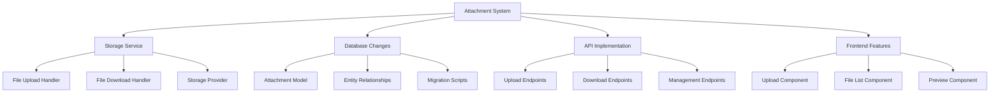

# Attachment System Plan

## Overview
Implement a comprehensive attachment system that allows users to upload, manage, and associate files with both properties and payments. This system will help landlords maintain important documents like lease agreements, receipts, invoices, and other property-related files.



## Technical Design

### 1. Database Schema

```sql
CREATE TABLE Attachments (
    Id UUID PRIMARY KEY,
    FileName VARCHAR(255) NOT NULL,
    ContentType VARCHAR(100) NOT NULL,
    FileSize BIGINT NOT NULL,
    StoragePath VARCHAR(1000) NOT NULL,
    EntityType VARCHAR(50) NOT NULL, -- 'Property' or 'Payment'
    EntityId UUID NOT NULL,
    UploadedAt TIMESTAMP NOT NULL,
    Description VARCHAR(500),
    Tags VARCHAR(255)[]
);
```

### 2. Storage Service

#### Components
- IStorageService interface for abstraction
- Local file system implementation for development
- Cloud storage implementation for production (e.g., Azure Blob Storage)
- File type validation and virus scanning integration
- Chunked upload support for large files

#### Key Methods
```csharp
Task<string> UploadFileAsync(Stream fileStream, string fileName);
Task<Stream> DownloadFileAsync(string storagePath);
Task DeleteFileAsync(string storagePath);
bool ValidateFileType(string contentType);
```

### 3. API Endpoints

#### Upload
- POST /api/properties/{propertyId}/attachments
- POST /api/payments/{paymentId}/attachments

#### Download
- GET /api/attachments/{attachmentId}/download
- GET /api/attachments/{attachmentId}/preview (for supported file types)

#### Management
- GET /api/properties/{propertyId}/attachments
- GET /api/payments/{paymentId}/attachments
- DELETE /api/attachments/{attachmentId}
- PATCH /api/attachments/{attachmentId} (update description/tags)

### 4. Frontend Implementation

#### Components
1. FileUploader
   - Drag-and-drop support
   - Multiple file selection
   - Upload progress indicator
   - File type validation
   - Size limit enforcement

2. AttachmentList
   - Grid/list view toggle
   - Sorting options
   - Preview capability
   - Download button
   - Delete option
   - Description/tags editor

3. FilePreview
   - Image preview for supported formats
   - Document preview for PDFs
   - Icon view for other file types
   - Basic file info display

### 5. Security Considerations

1. File Validation
   - Allowed file types whitelist
   - Maximum file size limits
   - Malware scanning integration point
   - Content type verification

2. Access Control
   - Attachment ownership validation
   - Download authorization
   - Delete permission checks

3. Storage Security
   - Secure file paths
   - Encrypted storage option
   - Temporary URL generation for downloads

## Implementation Phases

### Phase 1: Core Infrastructure
1. Create database schema and models
2. Implement basic storage service with local storage
3. Add basic upload/download endpoints
4. Create simple upload UI component

### Phase 2: Enhanced Features
1. Add file preview capabilities
2. Add progress tracking
3. Create attachment list component

### Phase 3: Security & Polish
1. Implement file validation
2. Add virus scanning integration point
3. Enhance error handling
4. Add batch operations support

### Phase 4: Cloud Storage
1. Create migration tools
2. Update documentation

## Testing Strategy

1. Unit Tests
   - Storage service operations
   - File validation logic
   - Model validations
   - Controller actions

2. Integration Tests
   - Upload flow
   - Download flow
   - Storage provider integration
   - Database operations

3. UI Tests
   - Upload component functionality
   - List view operations
   - Preview functionality
   - Error handling

## Monitoring & Maintenance

1. Metrics to Track
   - Upload success rate
   - Download performance
   - Storage usage
   - Error rates

2. Maintenance Tasks
   - Temporary file cleanup
   - Storage usage optimization
   - Performance monitoring
   - Security updates

## Future Enhancements

1. Advanced Features
   - Batch upload/download
   - Advanced search
   - Version control
   - Automatic file organization

2. Integration Options
   - Document OCR
   - Cloud storage sync
   - Digital signature support
   - Mobile app integration