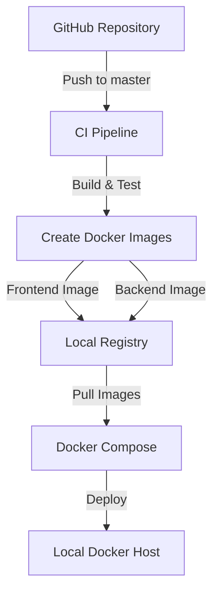
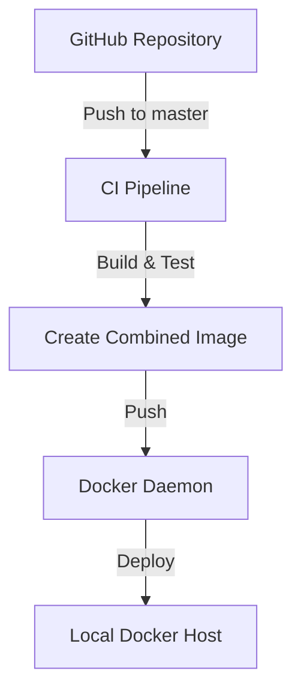
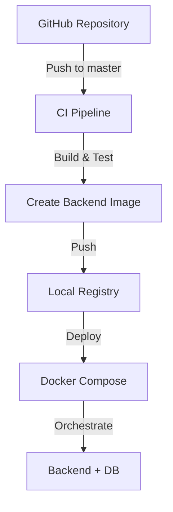

# CD Implementation Plan

## Current CI State Analysis
- GitHub Actions workflow on self-hosted runner
- Triggers: PR and push to master branch
- Builds and tests .NET 8.0 application
- Uses Release configuration

## Proposed CD Approaches

### Approach 1: Separate Containers with Docker Compose

#### Components:
- Frontend container (Blazor Client)
- Backend container (ASP.NET Core API)
- MongoDB container
- Docker Compose for orchestration
- Local Docker registry

#### Advantages:
- Independent scaling
- Easier monitoring
- Separate deployment cycles
- Clear separation of concerns

### Approach 2: Single Container Deployment

#### Components:
- Combined frontend/backend container
- MongoDB container
- Direct Docker daemon deployment

#### Advantages:
- Simpler deployment
- Reduced complexity
- Lower resource usage
- Easier initial setup

### Approach 3: Backend-Only Container

#### Components:
- Backend container
- MongoDB container
- Frontend deployed separately
- Docker Compose for database orchestration

#### Advantages:
- Frontend flexibility
- Simplified container management
- Focused backend scaling
- Reduced deployment complexity

## Implementation Requirements

### Security Considerations
1. Registry security
   - TLS certificates
   - Authentication
   - Network isolation

2. Secrets management
   - GitHub Secrets for credentials
   - Docker registry authentication
   - Database credentials

3. Network security
   - LAN-only access
   - Reverse proxy configuration
   - SSL/TLS termination

### Infrastructure Requirements
1. Docker host setup
   - Docker runtime
   - Docker Compose
   - Local registry

2. Network configuration
   - DNS resolution
   - Port mappings
   - Firewall rules

3. Monitoring
   - Container health checks
   - Log aggregation
   - Alert system

### CI/CD Pipeline Components
1. Docker configuration
   - Dockerfiles
   - .dockerignore
   - Multi-stage builds

2. GitHub Actions workflow
   - Build steps
   - Testing
   - Image creation
   - Push to registry
   - Deployment triggers

3. Deployment configuration
   - Docker Compose files
   - Environment variables
   - Volume mounts
   - Network settings

## Next Steps
1. Select preferred deployment approach
2. Create Docker configurations
3. Set up local infrastructure
4. Implement CD pipeline
5. Configure monitoring and alerts
6. Document deployment process

## Future Considerations
- Rolling updates strategy
- Backup procedures
- Scaling plans
- Monitoring improvements
- Automated rollback procedures

## Notes
This plan serves as a foundation for implementing continuous deployment to a local home server. The actual implementation will require selecting one of the proposed approaches and adapting the plan accordingly.