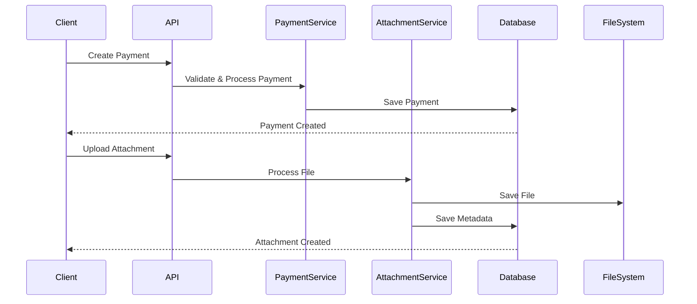

# Payment and Attachment System Implementation Plan

## Current Structure
The data models are already well-structured with proper relationships:
1. RentalProperty has one-to-many relationship with RentalPayment and Attachment
2. RentalPayment has one-to-many relationship with Attachment
3. Attachment can be associated with either a RentalProperty or RentalPayment

## API Endpoints Plan

### 1. Property Endpoints (Already Implemented)
- ✅ GET /api/properties
- ✅ GET /api/properties/{id}
- ✅ POST /api/properties
- ✅ PUT /api/properties/{id}
- ✅ DELETE /api/properties/{id}

### 2. Payment Endpoints (To Be Implemented)
```
/api/properties/{propertyId}/payments
```
- GET: List all payments for a property
- POST: Create a new payment for a property

```
/api/properties/{propertyId}/payments/{paymentId}
```
- GET: Get specific payment details
- PUT: Update payment details
- DELETE: Delete a payment

### 3. Attachment Endpoints (To Be Implemented)
```
/api/properties/{propertyId}/attachments
```
- GET: List all attachments for a property
- POST: Upload attachment for a property

```
/api/properties/{propertyId}/payments/{paymentId}/attachments
```
- GET: List all attachments for a payment
- POST: Upload attachment for a payment

```
/api/attachments/{attachmentId}
```
- GET: Get attachment details/download
- DELETE: Delete an attachment

## Implementation Details

### 1. PaymentsController
- Implement CRUD operations for payments
- Include validation for propertyId existence
- Handle payment-specific business logic
- Include proper error handling

### 2. AttachmentsController
- Implement file upload handling
- Support both property and payment attachments
- Include file type validation
- Implement secure file storage
- Handle file deletion cleanup

### 3. Service Layer
- Create PaymentService for payment-related business logic
- Create AttachmentService for file handling logic
- Implement proper validation and error handling

### 4. Database Updates
- No schema changes needed as models are already properly structured
- Ensure proper cascade delete behavior is configured

### 5. Security Considerations
- Implement file type validation
- Set maximum file size limits
- Secure file storage location
- Proper error handling and logging

## Sequence Diagram


## Implementation Order
1. Payment CRUD endpoints
2. File upload infrastructure
3. Attachment management endpoints
4. Integration testing
5. Security review

Created: 2025-03-30 19:28 AEDT