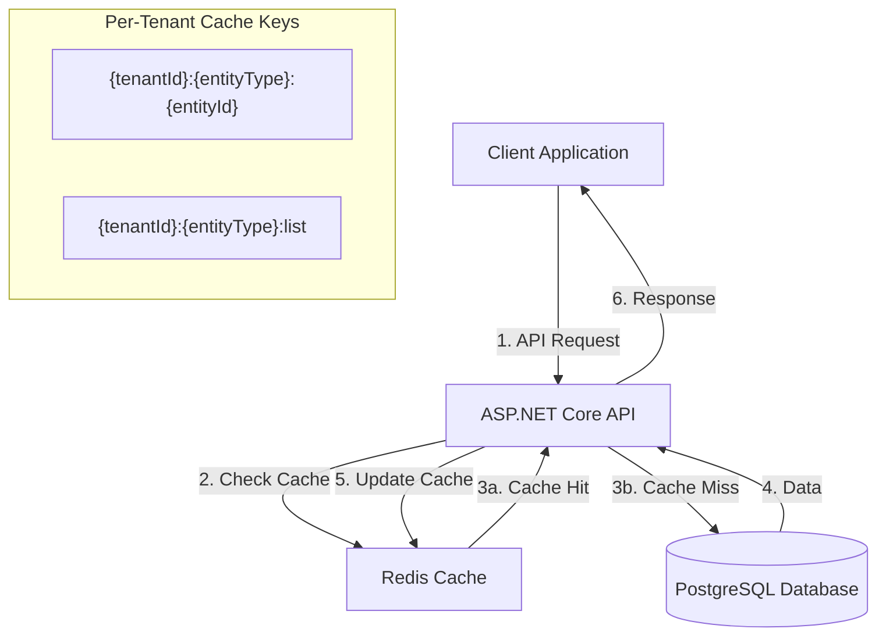
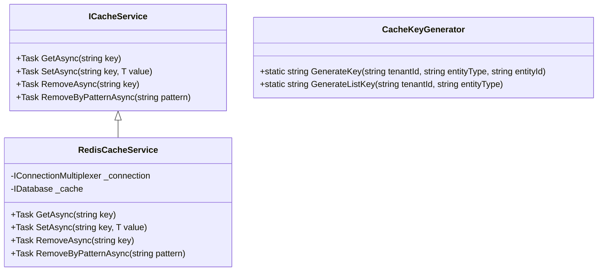
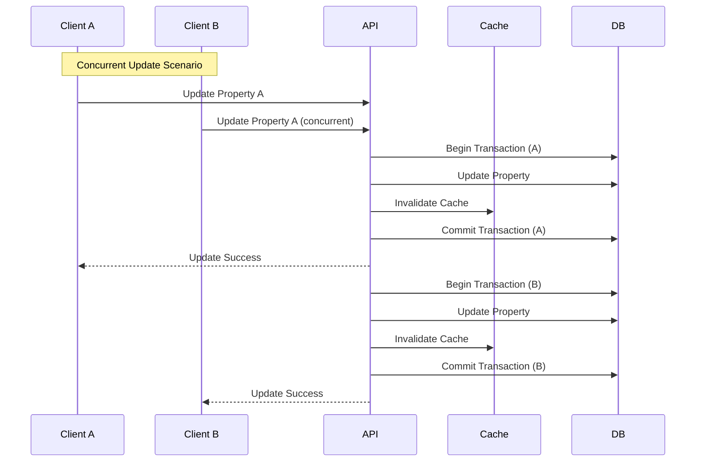
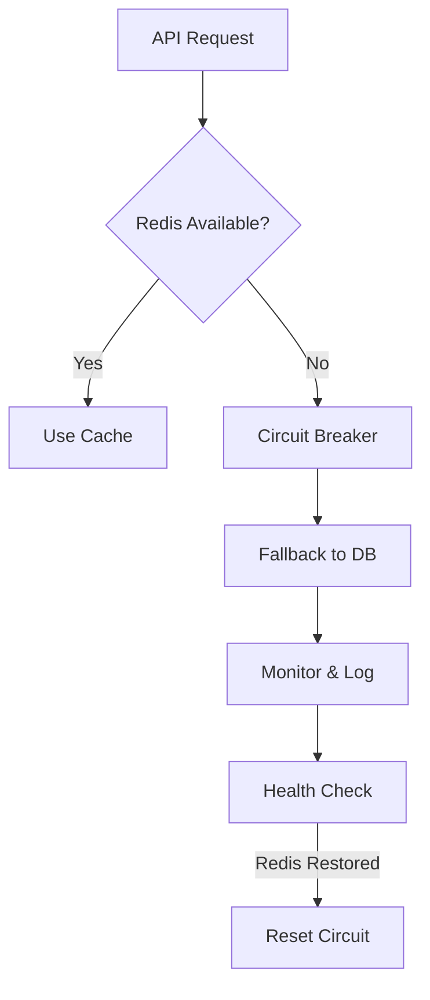

# Redis Cache Implementation Plan

## Overview
This document outlines the implementation plan for adding Redis as a caching layer to the RentTracker backend APIs, with focus on multi-tenant data protection and automatic cache invalidation.

## Architecture Overview



## Implementation Strategy

### 1. Redis Configuration
1. Add Redis configuration to `appsettings.json`:
   ```json
   {
     "Redis": {
       "ConnectionString": "localhost:6379",
       "InstanceName": "RentTracker_",
       "DefaultTimeoutMinutes": 10
     }
   }
   ```

### 2. Caching Service Design



### 3. Cache Key Strategy and Invalidation
#### Key Format
* Entity key: `{tenantId}:{entityType}:{entityId}`
* List key: `{tenantId}:{entityType}:list`
* Examples:
  * Single property: `tenant123:property:456`
  * Property list: `tenant123:property:list`
  * Payment: `tenant123:payment:789`

#### Properties Endpoints Cache Keys
1. **GET /api/properties (List)**
   - Cache Key: `{tenantId}:property:list`
   - Invalidated on:
     - POST /api/properties (new property)
     - PUT /api/properties/{id} (update)
     - DELETE /api/properties/{id} (delete)

2. **GET /api/properties/{id} (Single)**
   - Cache Key: `{tenantId}:property:{id}`
   - Invalidated on:
     - PUT /api/properties/{id} (update)
     - DELETE /api/properties/{id} (delete)

#### Payments Endpoints Cache Keys
1. **GET /api/properties/{propertyId}/payments (List)**
   - Cache Key: `{tenantId}:property:{propertyId}:payments:list`
   - Invalidated on:
     - POST /api/properties/{propertyId}/payments
     - PUT /api/properties/{propertyId}/payments/{paymentId}
     - DELETE /api/properties/{propertyId}/payments/{paymentId}

2. **GET /api/properties/{propertyId}/payments/{paymentId} (Single)**
   - Cache Key: `{tenantId}:payment:{paymentId}`
   - Invalidated on:
     - PUT /api/properties/{propertyId}/payments/{paymentId}
     - DELETE /api/properties/{propertyId}/payments/{paymentId}

### 4. Concurrency Control



#### Optimistic Concurrency Control
```csharp
public class RentalProperty
{
    // Concurrency token
    public byte[] RowVersion { get; set; }
}

// In EntityFramework configuration
modelBuilder.Entity<RentalProperty>()
    .Property(p => p.RowVersion)
    .IsRowVersion();
```

#### Double-Checked Locking for Cache Population
```csharp
public async Task<T> GetWithLock<T>(string key, Func<Task<T>> dataFactory)
{
    var cached = await _cache.StringGetAsync(key);
    if (!cached.IsNull)
        return JsonSerializer.Deserialize<T>(cached);

    var lockKey = $"lock:{key}";
    var lockValue = Guid.NewGuid().ToString();
    
    var locked = await _cache.StringSetAsync(lockKey, lockValue, 
        TimeSpan.FromSeconds(5), When.NotExists);
        
    if (locked)
    {
        try
        {
            cached = await _cache.StringGetAsync(key);
            if (!cached.IsNull)
                return JsonSerializer.Deserialize<T>(cached);

            var value = await dataFactory();
            await _cache.StringSetAsync(key, 
                JsonSerializer.Serialize(value),
                TimeSpan.FromMinutes(10));
                
            return value;
        }
        finally
        {
            await _cache.StringGetDeleteAsync(lockKey, lockValue);
        }
    }
    
    await Task.Delay(100);
    return await GetWithLock(key, dataFactory);
}
```

### 5. Resilience Strategy



#### Circuit Breaker Implementation
```csharp
public class RedisCacheCircuitBreaker
{
    private CircuitState _state = CircuitState.Closed;
    private const int FailureThreshold = 3;
    private static readonly TimeSpan ResetTimeout = TimeSpan.FromMinutes(1);

    public async Task<T> ExecuteAsync<T>(
        Func<Task<T>> cacheOperation,
        Func<Task<T>> fallbackOperation)
    {
        if (_state == CircuitState.Open)
        {
            if (DateTime.UtcNow - _lastError > ResetTimeout)
            {
                _state = CircuitState.HalfOpen;
            }
            else
            {
                return await fallbackOperation();
            }
        }

        try
        {
            var result = await cacheOperation();
            if (_state == CircuitState.HalfOpen)
            {
                _state = CircuitState.Closed;
                _failureCount = 0;
            }
            return result;
        }
        catch (RedisConnectionException)
        {
            _failureCount++;
            if (_failureCount >= FailureThreshold)
            {
                _state = CircuitState.Open;
                _lastError = DateTime.UtcNow;
            }
            return await fallbackOperation();
        }
    }
}
```

### 6. Health Monitoring

1. **Health Checks**
   - Redis connection status
   - Circuit breaker state
   - Connection latency
   - Cache hit/miss rates

2. **Alerts**
   - Circuit breaker state changes
   - Connection failures
   - High error rates
   - Performance degradation

### 7. Implementation Phases

1. **Phase 1: Infrastructure Setup**
   - Redis configuration
   - Basic caching service
   - Circuit breaker implementation
   - Health monitoring

2. **Phase 2: Core Caching**
   - Property endpoints caching
   - Payment endpoints caching
   - Concurrency handling
   - Cache invalidation

3. **Phase 3: Resilience**
   - Circuit breaker integration
   - Fallback mechanisms
   - Error handling
   - Recovery procedures

4. **Phase 4: Monitoring**
   - Health checks
   - Performance metrics
   - Alert system
   - Documentation

### 8. Security Considerations

1. **Tenant Isolation**
   - Tenant ID in all cache keys
   - Validation at controller level
   - Validation at cache service level

2. **Data Protection**
   - Encrypted Redis connection
   - Secure serialization
   - Access control validation

3. **Cache Security**
   - Key pattern validation
   - Value validation
   - TTL enforcement

### 9. Performance Expectations

1. **Response Time Targets**
  - Cache Hit: < 10ms
  - Cache Miss: < 100ms (including DB query)
  - Write Operations: < 150ms (including cache invalidation)

2. **Cache Hit Ratio Targets**
  - List Operations: > 80%
  - Single Entity Operations: > 90%
  - Overall System: > 85%

3. **Resource Usage**
  - Redis Memory: < 2GB
  - Redis CPU: < 20%
  - Network Bandwidth: < 100MB/s

4. **Monitoring Thresholds**
  - Circuit Breaker Trip Rate: < 1% of requests
  - Error Rate: < 0.1% of requests
  - Cache Inconsistency Rate: < 0.01%

### 10. Backup and Recovery

1. **Redis Persistence**
  - Enable RDB Snapshots
  - Snapshot Frequency: Every 15 minutes
  - AOF (Append-Only File) enabled
  - AOF fsync: every second

2. **Backup Strategy**
  - Daily full backup of RDB files
  - Retain 7 days of backups
  - Automated backup verification
  - Regular recovery testing

3. **Recovery Procedures**
  - Automatic failover for replicas
  - Manual intervention process documented
  - Cache warming after recovery
  - Consistency verification steps

### 11. Deployment Considerations

1. **Infrastructure Requirements**
  - Redis Version: 6.2 or higher
  - Minimum Memory: 4GB RAM
  - Recommended CPU: 2 cores
  - Network: Low latency (<1ms) between app and Redis

2. **Configuration Changes**
  - Update appsettings.json
  - Add Redis health check
  - Configure metrics collection
  - Set up monitoring alerts

3. **Deployment Steps**
  - Deploy Redis instance
  - Apply security configurations
  - Update application configuration
  - Deploy application changes
  - Verify monitoring
  - Load test in staging

4. **Rollback Plan**
  - Snapshot before deployment
  - Revert application changes process
  - Redis configuration backup
  - Recovery time objective: 5 minutes